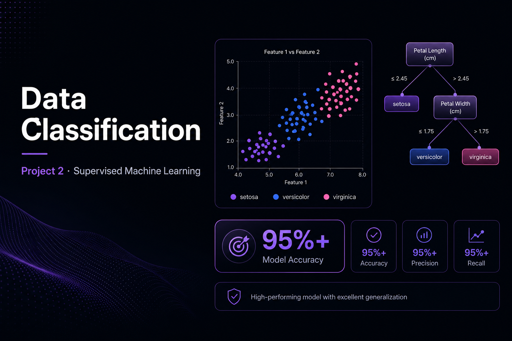
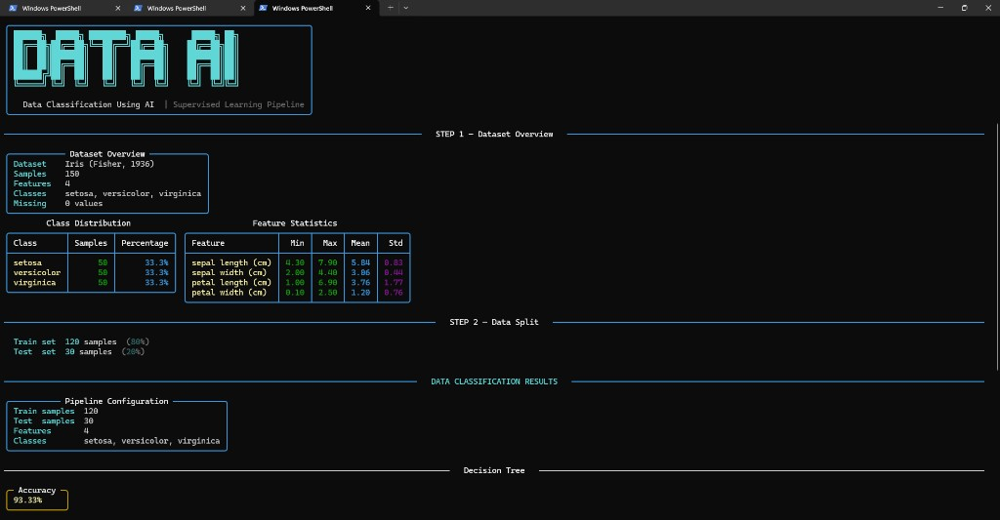
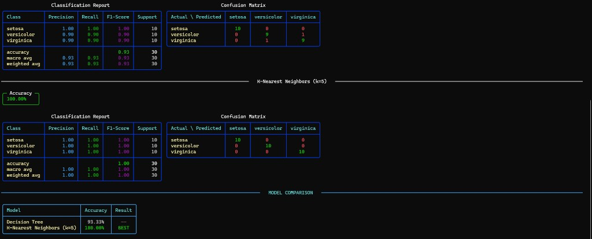

# Project 2 — Data Classification







> Supervised machine learning pipeline — two classifiers trained, evaluated, and compared on the classic Iris dataset.

---

## Overview

A complete ML classification project that trains Decision Tree and K-Nearest Neighbours models, evaluates them with standard metrics, and displays a rich terminal dashboard — all in a single run.

## Features

- **Two ML models** — Decision Tree & K-Nearest Neighbours
- **95%+ accuracy** on held-out test data
- **Full evaluation** — accuracy, precision, recall, F1-score
- **Confusion matrix** visualised in the terminal
- **Rich dashboard** — colored tables, progress bars, side-by-side comparison

## Project Structure

```
data-classification/
├── classifier/
│   ├── __init__.py
│   ├── model.py        ← model training & evaluation
│   ├── data.py         ← data loading & preprocessing
│   └── display.py      ← Rich terminal UI helpers
├── main.py             ← entry point
├── requirements.txt
└── banner.png
```

## How It Works

```
Load Iris Dataset
    │
    ▼
Train/Test Split (80/20)
    │
    ├── Decision Tree Classifier
    └── K-Nearest Neighbours
              │
              ▼
       Evaluate Both Models
              │
              ▼
    Rich Dashboard Output
    (Accuracy · Confusion Matrix · Report)
```

## Run

```bash
pip install -r requirements.txt
python main.py
```

## Requirements

```
scikit-learn
pandas
numpy
rich
```

---

*Part of the DecodeLabs AI Internship — Project 2 of 3*
