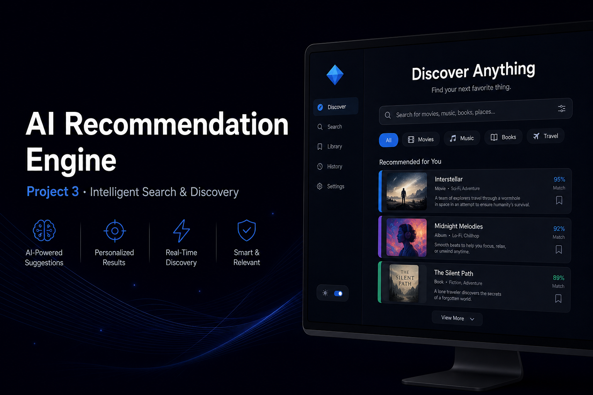
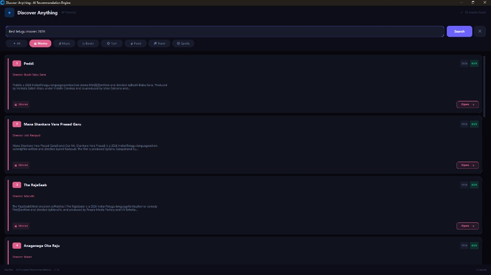

# Project 3 — AI Recommendation Engine





> A live desktop application that discovers movies, music, books, travel spots, food, sports & tech — powered by real web data, no API keys needed.

---

## Overview

"Discover Anything" is a premium dark-mode desktop app built with CustomTkinter. It performs live DuckDuckGo searches and scrapes structured data from reliable sources (IMDb, Last.fm, Wikipedia, Goodreads) to return actual item names — not website links.

## Features

- **Live web search** via DuckDuckGo — no API key, no login
- **7 categories**: Movies, Music, Books, Travel, Food, Sports, Tech
- **Category-specific scrapers**:
  - Movies → Wikipedia tables (IMDb linked)
  - Music → Last.fm track listings
  - Books → Wikipedia genre category pages
  - Travel → Wikipedia tourist attraction category pages
  - Food, Sports, Tech → DuckDuckGo snippet extraction
- **Streaming results** — cards appear one by one as data arrives
- **Premium dark-mode UI** — blue diamond logo, category pills, score badges, hover effects
- **Multi-threaded** — UI stays responsive during searches

## Project Structure

```
recommendation-engine/
├── recommender/
│   ├── __init__.py
│   ├── catalog_scraper.py   ← category scrapers + DuckDuckGo search
│   ├── ranker.py            ← relevance scoring algorithm
│   └── utils.py             ← shared helpers
├── app.py                   ← CustomTkinter desktop UI
├── requirements.txt
└── banner.png
```

## How It Works

```
User types query + selects category
              │
              ▼
    DuckDuckGo search (ddgs)
              │
         ┌────┴────┐
         │         │
    Catalog     Web Results
    Scraper     (fallback)
         │
    Category Router
    ├── movies  → Wikipedia table
    ├── music   → Last.fm
    ├── books   → Wikipedia category
    ├── travel  → Wikipedia attractions
    └── others  → snippet extraction
              │
              ▼
    Relevance Scoring
              │
              ▼
    Stream Cards → Desktop UI
```

## Run

```bash
pip install -r requirements.txt
python app.py
```

## Requirements

```
customtkinter
duckduckgo-search
requests
beautifulsoup4
```

---

*Part of the DecodeLabs AI Internship — Project 3 of 3*
