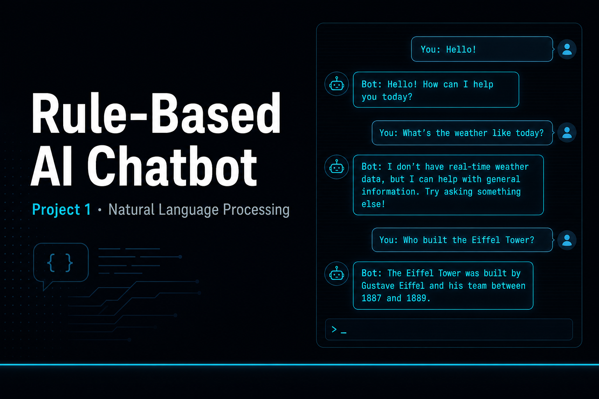
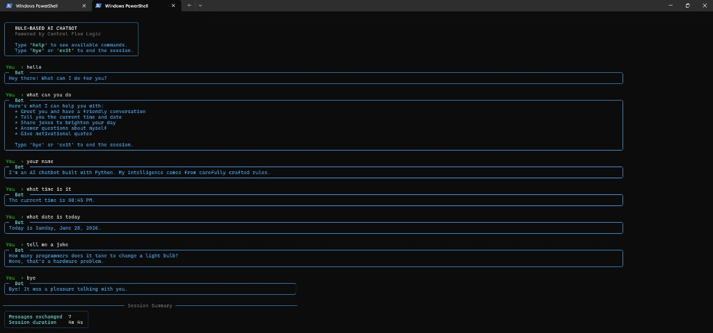

# Project 1 — Rule-Based AI Chatbot





> A professional terminal chatbot built using pure rule-based NLP — no external AI APIs, no cloud dependencies.

---

## Overview

This chatbot uses a hand-crafted intent engine with regex pattern matching to understand user input and respond intelligently across multiple topics. Built to demonstrate how rule-based AI works under the hood — the foundation of all conversational AI systems.

## Features

- **Intent Engine** — regex patterns match user input to predefined intents
- **Multi-topic support** — greetings, farewells, weather, jokes, facts, help
- **Fallback handling** — graceful responses for unrecognised input
- **Rich terminal UI** — colored banners, panels, and formatted output

## Project Structure

```
rule-based-chatbot/
├── chatbot/
│   ├── __init__.py
│   ├── engine.py       ← core intent matching logic
│   ├── intents.py      ← all intent patterns & responses
│   └── utils.py        ← terminal display utilities
├── main.py             ← entry point
├── requirements.txt
└── banner.png
```

## How It Works

```
User Input
    │
    ▼
Regex Pattern Matching  ←── intents.py (patterns + responses)
    │
    ▼
Best Intent Selected
    │
    ▼
Random Response Picked  ──► Terminal Output (Rich UI)
```

## Run

```bash
pip install -r requirements.txt
python main.py
```

## Requirements

```
rich
```

---

*Part of the DecodeLabs AI Internship — Project 1 of 3*
